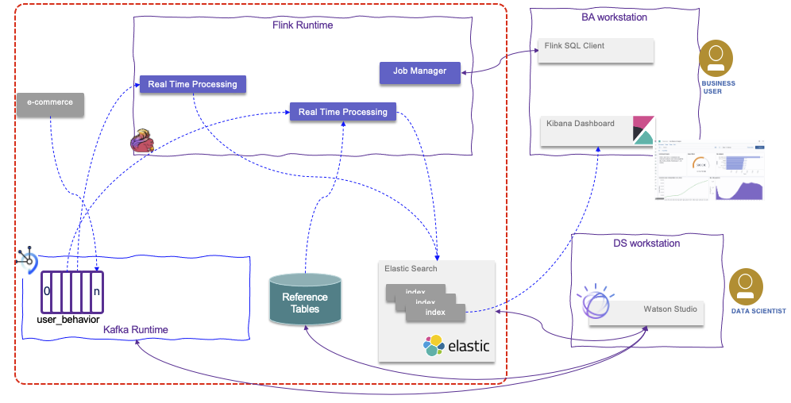

# Item Inventory with Flink

This project illustrates how to use Flink SQL to implement the near real-time inventory scenario presented in [IBM event-driven reference architecture](https://ibm-cloud-architecture.github.io/refarch-eda/scenarios/realtime-inventory/). 

The following diagram illustrates the potential architecture of the solution



The components of the solution includes at least:

* A source of sell events, and we use the [Store Simulator app](https://github.com/ibm-cloud-architecture/refarch-eda-store-simulator) for that.
* Event Streams as Kafka run time. (Strimzi for running locally in development mode)
* Flink Run time to support task creation and job management
* Elastic search for indexing computation

## Run locally with docker compose

If you have a recent version of docker, you can run 

```sh
docker compose up -d
```

Things to do:

- Open the simulator at http://localhost:8000
- Browse Kafka messages with Kafdrop at http://localhost:9000

Note: the `flink_job` service currently fails until the `items` topic appears in Kafka.
Once items are generated, run `docker-compose start flink_job` to start the job.
Items are generated on the "Simulator" page in the UI.

As new items appear in Kafka, insert and update entries will appear in the stdout log.

### SQL Client

After running `docker-compose up` and generating some items in the simulator, start the SQL client:

```sh
docker-compose exec jobmanager bin/sql-client.sh
```

When the client appears, create the source table:

```sql
CREATE TABLE items (
  id INT,
  price FLOAT,
  quantity INT,
  sku STRING,
  storeName STRING,
  `timestamp` STRING,
  `type` STRING
) WITH (
  'connector' = 'kafka',
  'topic' = 'items',
  'properties.bootstrap.servers' = 'kafka:29092',
  'scan.startup.mode' = 'earliest-offset',
  'format' = 'json'
);
```

Then run query:

```sql
SELECT
  storeName,
  sku,
  COUNT(*) AS transactions,
  AVG(CASE WHEN `type` = 'RESTOCK' THEN `price` ELSE null END) AS average_restock_price,
  AVG(CASE WHEN `type` = 'SALE' THEN `price` ELSE null END) AS average_sale_price,
  SUM(CASE WHEN `type` = 'SALE' THEN -`quantity` ELSE `quantity` END) AS on_hand
FROM items
GROUP BY storeName,sku;
```

### Next steps

- Fix bug where job stops if topic not present yet
- Expose swagger/openapi web UI
- Return current state of query per API request
